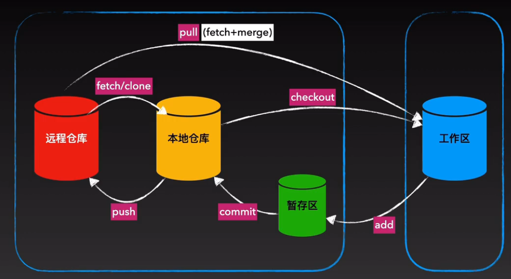
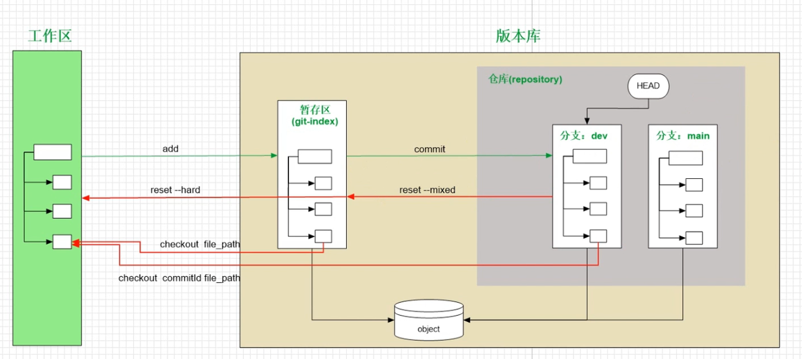
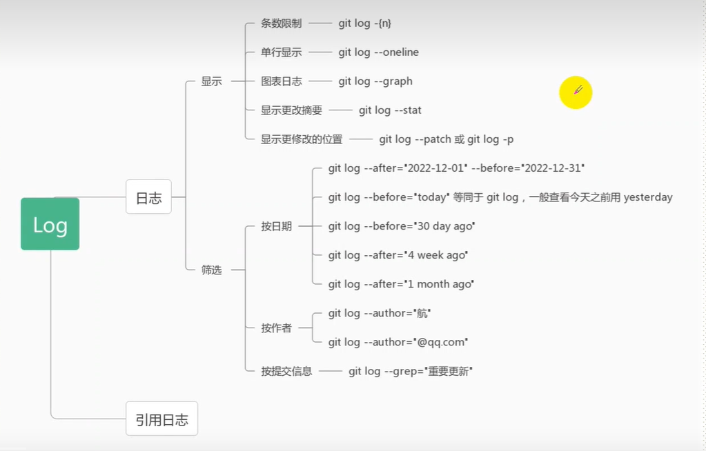

---
title: Git学习笔记
categories:
  - 学习笔记
tags:
  - Git 重要
toc: true# 是否启用内容索引
---
😍😍😍
### 流程




- 远程仓库(github)
- 本地仓库(本机)
- 缓冲区(防止误提交)
- 工作区(写代码的地方)


>github用户名密码存储在用户管理中的管理Windows凭据.
git status 查看文件当前所处位置
---

### gitignore 忽略文件

`根目录创建  .gitignore`
1. 每个配置项单独一行
2. 可以有空行,方便阅读
3. 可以是文明目录名,路径或者匹配模式
4. 如果一个文件已经被提交过了,再ignore没有用

```bash
模式匹配
# 用于注释  \用于转义

* 匹配任意字符任意次  ?匹配任意字符1次  但都不匹配/

[] 用于匹配列表里面的一个字符

**用于匹配多级目录

/用户分隔目录
    1)如果/在开头,则匹配根目录下的文件, 否则 所有子文件夹里的文件都会匹配
    2)/ 在末尾时, 只匹配目录, 否则同名的文件和目录都会匹配

! 用于重新包含某个文件, 如果这个文件的父级目录被排除了,那么它不回被包含了


例:
1) 忽略所哟内容   
    *
2) 忽略所有目录   
    */
3) 忽略public 目录下的某个文件   
    public/*
    !public/xxxxxxx
4) 只保留public目录下的某个文件
    /*
    !/public/
    /public/*
    !/public/a?z.*

如何检查自己写的ignore规则是否对

git check-ignore [-v] {文件或目录路径}

```


---

### 分支操作

```bash
git branch -a  查看所有分支
git branch dev  创建分支
git checkout dev 切换分支
git branch -d dev 删除分支
git branch -m 旧名称 新名称 重命名分支
git checkout -b dev 创建并切换分支
git merge dev 合并分支  切换到主分支上,然后再合并子分支,将dev合并到当前分支

# 将本地分支推送到远程
git push origin --all
git push origin 分支名
git push origin -d 分支名  删除远端分支

```
`修改分支名称`:[参考](https://blog.jiabh.cn/2021/rename-branch-from-main-to-master/#:~:text=%E5%8F%AF%E4%BB%A5%E7%9C%8B%E5%88%B0%EF%BC%9A-,%E5%9C%A8GitHub%E4%B8%8A%E5%B0%86%E9%BB%98%E8%AE%A4%E5%88%86%E6%94%AF%E4%BF%AE%E6%94%B9%E4%B8%BA%20master,%E4%BA%86%E9%BB%98%E8%AE%A4%E5%88%86%E6%94%AF%E7%9A%84%E4%BF%AE%E6%94%B9%E3%80%82)

---

### Merge 合并

`修改之前尽量先pull一下`

- 远程仓库已更新,本地没pull,直接修改,之后push,会显示push失败,会提示git pull.
- 在git pull之后,
- 1. 可能会有自动合并,auto-merging, 修改同一文件不同位置
- 2. 需要手动合并,此时解决冲突需要和冲突者商量,合并时会新建一个临时分支
- ,修改之后重新提交,add commit push,修改同一文件同一位置
- `<<<<<<<<HEAD  冲突开始`
- `=============== 不同的内容分隔符`
- `>>>>>>>>>>>>>>>>冲突结束`

---

### 版本回退

```bash
# 整个文件夹回退

# 查看历史记录,这个说明commit里面的说明一定要写详细,只会显示当前提交之前的版本
git  log --oneline

# 回退到某一个版本,后面提交的就看不到了
git reset --hard 输入版本号

# 查看从现在到最新的commit id
git reflog 

# 回到最新的版本
git reset --hard commit id


# 单个文件回退,提交修正

# 对错误文件修正,提交时漏交文件,提交信息修正,长开发中小提交过多
# 修正之后不会在log中显示
git commit --amend -m "提交说明"

```
---

### 文件恢复

1. 修改或删除之后,没有add
    - git checkout 文件名
    - 会还原成上一次add的文件

2. 修改或删除之后,add了,但没有commit
    - git checkout commit_id 文件名

3. 修改或删除之后,已commit
    - git checkout commit_id 文件名



---

### 查看日志


`普通日志`


`引用日志`

```bash
# 项目的最后一根稻草
# 本地日志,不会上传到远端,会把文件回退修正的记录也列出来
git reflog


```

---

### 标签管理


发行: 在github上create a new release

### fork
复制别人的仓库
然后克隆到本地
修改提交...
向原仓库发生和并请求,contribute,open a pull request
等待原始仓库同意合并


---

### 本地库与远程库进行关联

1. github新建仓库
2. 本地git init初始化
3. git remote add origin https://  关联远程
4. git push -u origin 分支名称
5. 如果添加第二个远程仓库,修改origin为一个新的
6. *git remote 参数,设置远程仓库的信息  -h查看命令帮助
7. git remote -v 查看仓库
8. git push 远端库名称 分支名称

---


### github仓库美化
 


 

 

 


 


 

[图标修改](https://badgen.net/)


---
### 流程 

git发布流程
分支合并发布流程：
git add .			# 将所有新增、修改或删除的文件添加到暂存区
git commit -m "版本发布" # 将暂存区的文件发版
git status 			# 查看是否还有文件没有发布上去
git checkout test	# 切换到要合并的分支
git pull			# 在test 分支上拉取最新代码，避免冲突
git merge dev   	# 在test 分支上合并 dev 分支上的代码
git push			# 上传test分支代码